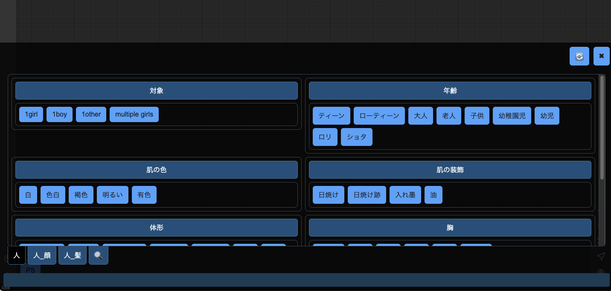
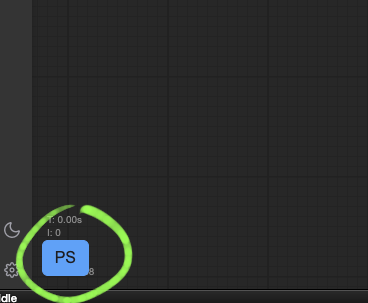
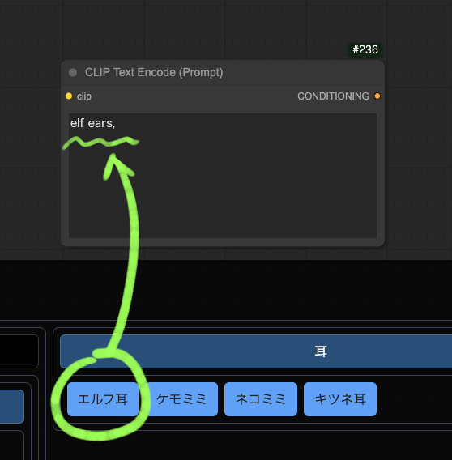
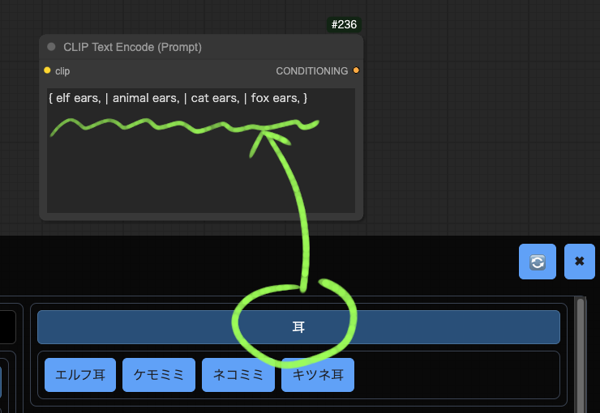
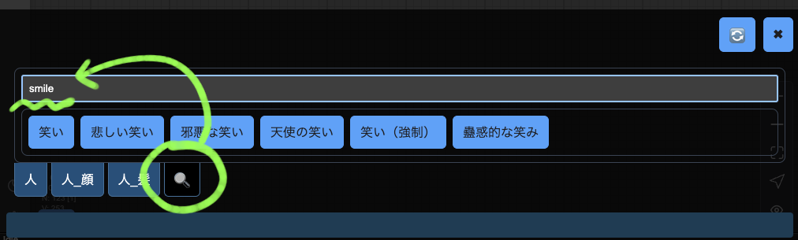
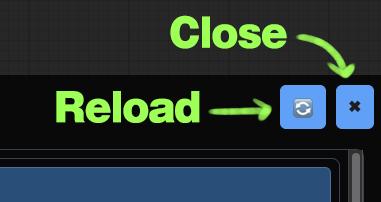
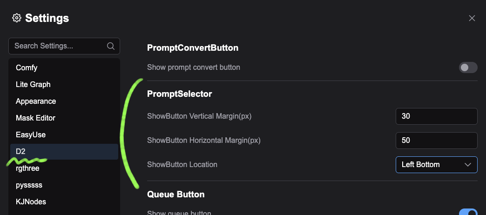

# D2-PromptSelector-comfyUI

<figure>
    <a href="README_en.md">English</a> | <a href="README.md">日本語</a> | <a href="README_zh.md">繁体中文</a>
</figure>


登録したプロンプトをボタン一発で入力するユーティリティです。

StableDiffusion webui A1111 用の機能拡張 [sd-d2-prompt-selector](https://github.com/da2el-ai/sd-d2-prompt-selector) をComfyUI用に作り変えたものです。


<figure>

</figure>


## 使い方

画面左端の「PS」ボタンで開きます。

<figure>
    
</figure>

タグボタンをクリックすると**最後にアクティブだったテキストエリア**に入力されます。

**【TIPS】** 右クリックした場合はタグを入力した後、PromptSelectorのダイアログを閉じます。

<figure>
    
</figure>

カテゴリーボタンをクリックすると DynamicPrompt構文で入力されます。

<figure>
    
</figure>

🔍ボタンをクリックすると検索ができます。

<figure>
    
</figure>


## タグの追加

インストール先の `tags` フォルダのYAMLファイルを編集します。
例：`ComfyUI/custom_nodes/d2-promptselector-comfyui/tags`

YAMLはただのテキストファイルなのでメモ帳アプリなどで編集可能です。
個人的にはVisualStudioCodeがオススメです。

YAMLファイルを追加した時は `__config__.yml` を編集する必要があります。
`ポーズ.yml` を追加したら下記のようになります。順番は任意に変更できます。

```yaml:__config__.yml
sort:
  - 人
  - 人_顔
  - 人_髪
  - ポーズ
```

🔄ボタンをクリックすると編集したタグが反映されます。

<figure>
    
</figure>


## 設定

「PS」ボタンの位置は Settings で指定できます。

<figure>
    
</figure>

- ShowButton Vertical Margin(px)
  - 画面端からのY座標
- ShowButton Horizontal Margin(px)
  - 画面端からのX座標
- ShowButton Location
  - 画面端の基準位置


