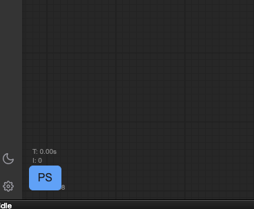

# D2-PromptSelector-comfyUI

[sd-d2-prompt-selector](https://github.com/da2el-ai/sd-d2-prompt-selector) をComfyUI用に作り変えたものです。

とりあえず作った試作です。

sd-d2-prompt-selector のランダム構文は使えません。
DynamicPrompt構文を使用します。

## 使い方

画面左端の「PS」ボタンで開きます。

「PS」ボタンの位置は Settings で指定できます。

