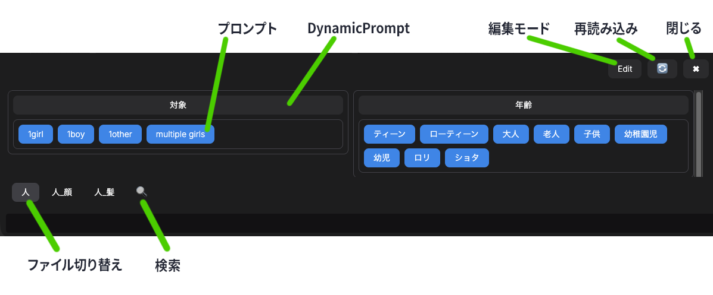
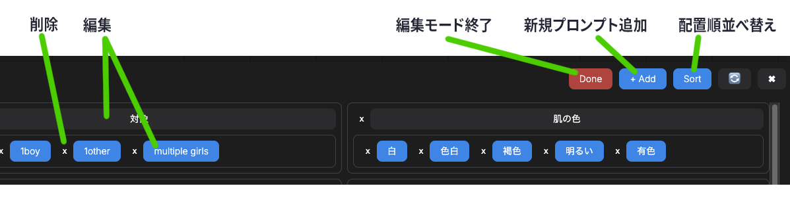

# D2-PromptSelector-comfyUI

[English](README_en.md) | [日本語](README.md) | [繁體中文](README_zh.md)

A utility for inserting registered prompts with a single button click.

Ver.2 adds prompt editing features.


---

## Features

- **Easy prompt input:** Insert a registered prompt with a button click
- **Editing:** Add, edit, delete, and reorder prompts and categories
- **Search:** Real-time search across names and prompts
- **Multilingual:** Japanese / English / Simplified Chinese / Traditional Chinese (users can add languages)
- **Auto backup:** Keeps up to 10 versions by default


---


## Opening Prompt Selector

Open it with the "PS" button at the bottom-left of the screen.


## Panel operations




### Prompt

Clicking a prompt button inserts the prompt into the **text area that was last active**.

>【TIP】 Right-click (or Ctrl+click) inserts the prompt and then closes the Prompt Selector panel.

### DynamicPrompt

Clicking a category-name button inserts every prompt in that category using DynamicPrompt syntax.

Example:<br>
Category: `hair color`<br>
Registered prompts: `black hair` `blonde hair` `silver hair`<br>
Result: `{ black hair, | blonde hair, | silver hair, }`

※ To use DynamicPrompt syntax, you need a custom node such as [comfyui-dynamicprompts](https://github.com/adieyal/comfyui-dynamicprompts).

### Switching files (tabs)

Each prompt file is a tab.<br>
You can add tabs by adding files in the edit mode described below.

### Search

Select the 🔍 tab to search. Both names and prompts are matched by partial match.

### Edit

Enters edit mode (described below).

### Reload

Click the 🔄 button to reload the prompt files and refresh the prompt list to the latest state.


---

## Edit mode

Enter edit mode with the "Edit" button at the left end of the controller bar. Use "Done" to return.




### Adding a prompt

In edit mode, clicking the "+ Add" button opens the add dialog, where you enter:

- Tab (file): choose an existing one or create a new one
- Category: choose an existing one or create a new one
- Name (display name)
- Prompt (multi-line supported)

### Editing / deleting a prompt

In edit mode, clicking a prompt button opens the edit dialog. The `×` shown to the left of each prompt deletes it.

### Editing / deleting a category

In edit mode, clicking a category-name button opens the edit dialog, where you can rename it or move it to another file. The `×` to the left of the category name deletes the whole category (all contained prompts are deleted too).

### Deleting a file

In edit mode, the `×` button to the left of each tab deletes the file. When deleting, you must type the file name exactly in the confirmation dialog (to prevent mistakes).

Renaming a file is done in the sort-order dialog described below.

### Sort-order dialog

In edit mode, the "Sort" button opens a tree-view dialog.


- Displays the three levels File → Category → Prompt as a tree
- Click a label to open the edit dialog
- Drag `⋮⋮` to reorder
- Click `x` to delete


### For users of older versions: editing restriction

The first time you try to enter edit mode, if a prompt file is in the old format (nested levels / mixed arrays), a conversion confirmation dialog is shown. The state before conversion is backed up to the `tags_migration/` folder.

**Before conversion:**
```
hair:
  color:        # category is multi-level
    black: black hair,
    blonde: blonde hair,
hair style:
  - ponytail    # an unnamed list
  - twintails
```
**After conversion:**
```
hair > color:   # flattened
  black: black hair,
  blonde: blonde hair,
hair style:
  ponytail: ponytail    # becomes a named list
  twintails: twintails
```

---

## Backup

Immediately before any write operation (add / edit / delete / rename file), a snapshot of the entire `tags/` is automatically saved to a `tags_bak_YYYYMMDD_HHMMSS/` folder.

- The number of kept snapshots can be changed with the **Backup Count** setting (default 10, max 100, 0 to disable)
- Old backups beyond the limit are deleted automatically
- Reordering (drag & drop) does not create a backup
- Migration (old format → new format) is saved to the dedicated `tags_migration/` folder (not subject to rotation)

---

## D2 Prompt Selector text-conversion node


This node is for people who find it tedious to call up prompts from the panel.

It detects special tokens in the input text, converts them into registered prompts, and outputs the result. **Instead of clicking buttons on the panel, you can assemble prompts inside the workflow.**

- Converts `--{name}--` into the registered prompt
- Converts `@@{category}@@` into the prompts of that category using DynamicPrompt syntax
- Matching is exact. The delimiters `--` and `@@` can be changed via inputs (to avoid conflicts with other extensions)

### Input

| Input | Type | Description |
| --- | --- | --- |
| `string` | STRING | Prompt input<br>e.g. `1girl, --beautiful--, best quality` |
| `delete_unmatch` | BOOLEAN | How to handle tokens that could not be converted<br>`True`: delete the token<br>`False`: keep the token as-is |
| `delimiter` | STRING | Delimiter for normal-conversion tokens<br>default: `--` |
| `dynamic_delimiter` | STRING | Delimiter for DynamicPrompt-conversion tokens<br>default: `@@` |

### Output

| Output | Type | Description |
| --- | --- | --- |
| `string` | STRING | The converted text |

### Token format

Entering `--{name}--` outputs the registered prompt.
If multiple prompts are registered under the same name, you can pinpoint one with the full path `{tab}/{category}/{name}`.

Assume the following file is registered:

```yaml
# bg.yml (tab name: bg)
quality:
    beautiful: Beautiful lighting, highly detailed environment
place:
    stream: nature, stream, rock, wood
    classroom: classroom, window, curtain, desk, chair, chalkboard
```

```
Input  : 1girl, solo, --beautiful--, best quality
Output : 1girl, solo, Beautiful lighting, highly detailed environment, best quality
```

To pinpoint with a full path, write it as `--bg/quality/beautiful--`.

Writing a category name as `@@{category}@@` outputs the prompts in that category using DynamicPrompt syntax.
Likewise, if multiple categories share the same name, you can pinpoint one with the full path `{tab}/{category}`.

```
Input  : @@place@@
Output : { nature, stream, rock, wood, | classroom, window, curtain, desk, chair, chalkboard, }
```

To pinpoint with a full path, write it as `@@bg/place@@`.

### Format reference

| Format | Conversion |
| --- | --- |
| `--name--` | Searches all tabs in order and converts to the prompt of the first matching name<br>e.g. `--stream--` |
| `--tab or category/name--` | Searches within the specified tab. If not found, treats the first part as a category name and searches all tabs<br>e.g. `--bg/stream--` `--place/stream--` |
| `--tab/category/name--` | Full-path specification of tab, category, and name<br>e.g. `--bg/place/stream--` |
| `@@category@@` | Searches all tabs in order and outputs the first matching category in DynamicPrompt syntax<br>e.g. `@@place@@` |
| `@@tab/category@@` | Full-path specification of tab and category<br>e.g. `@@bg/place@@` |

- Searches follow the tab order (`sort` in `__config__.yml`) and convert using the first match
- Matching is exact (`beautiful` does not match `beautiful2`)
- Tokens that contain spaces (e.g. `-- bg / quality / beautiful --`) are not converted


---

## Editing prompt files directly

You can also edit the prompt files (YAML format) directly.<br>
The files are stored in `{ComfyUI install folder}/custom_nodes/D2-PromptSelector-comfyUI/tags/`.

```yaml
対象:
    1girl: 1girl
    1boy: 1boy

年齢:
    ティーン: teen
    ローティーン: early teen
```

- Each category is a `name: prompt` dictionary
- Names may contain non-alphanumeric characters
- Nesting of two or more levels and array format are not supported (old-format files show a conversion dialog on first edit)

### Adding a file

After adding a new YAML file to `tags/`, append it to `sort` in `__config__.yml`.<br>
The order can be changed freely.

```yaml
# __config__.yml
sort:
    - 人
    - 人_顔
    - 人_髪
    - ポーズ
```

Changes take effect via the 🔄 button or by reloading ComfyUI.

---

## Settings

The following can be configured from ComfyUI's Settings.


| Setting                          | Description                                       |
| -------------------------------- | ------------------------------------------------- |
| ShowButton Location              | Reference edge position of the "PS" button        |
| ShowButton Horizontal Margin(px) | Horizontal (X) margin from the screen edge        |
| ShowButton Vertical Margin(px)   | Vertical (Y) margin from the screen edge          |
| Backup Count                     | Number of backups kept (0–100, 0 to disable)      |

---

## Multilingual support

For supported languages and how to add your own, see [docs/i18n_en.md](docs/i18n_en.md).

---

## License

MIT
