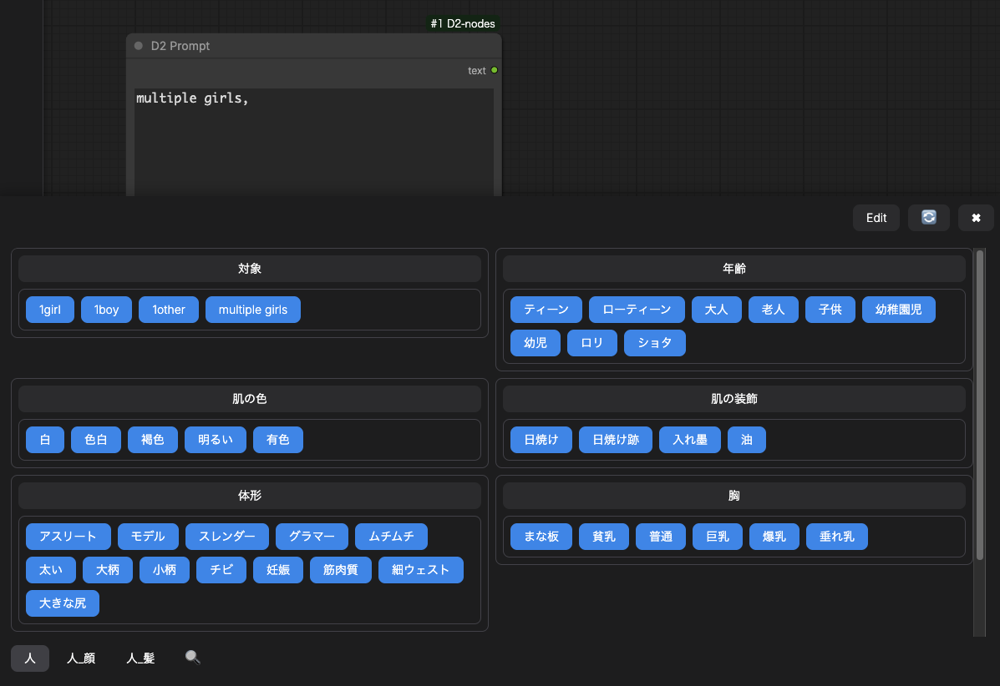
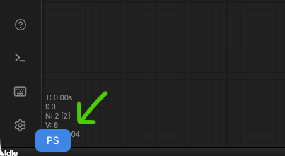

# D2-PromptSelector-comfyUI

[English](README_en.md) | [日本語](README.md) | [繁體中文](README_zh.md)

A utility that lets you insert registered prompts with a single button click.

Ver.2 adds prompt editing features.




---

## Features

- Quick prompt input: Insert registered prompts with a single click
- Editing: Add, edit, delete, and reorder prompts and categories
- Search: Real-time search across display names and prompts
- Multi-language: Japanese / English / Simplified Chinese / Traditional Chinese (users can add more)
- Auto-backup: Keeps up to 10 previous versions by default


<video src="./img/prompt-selector.mp4" controls width="600"></video>

---


## Opening the Prompt Selector

Click the "PS" button at the bottom-left of the screen.




## Panel controls


### Prompt

Clicking a prompt button inserts the prompt into the **last active text area**.

**[TIP]** Right-click (or Ctrl+click) to insert the prompt and then close the Prompt Selector panel.

### DynamicPrompt

Clicking a category name button inserts all prompts in that category using DynamicPrompt syntax.

Example:<br>
Category: `Hair color`<br>
Registered prompts: `black hair` `blonde hair` `silver hair`<br>
Result: `{ black hair, | blonde hair, | silver hair, }`


### Search

Select the 🔍 tab to search. Both the display name and the prompt text are searched with partial matching.

### Edit

Enters edit mode (see below).

### Reload

Clicking the 🔄 button reloads the dictionary files and refreshes the prompt list.


---

## Edit mode

Click the "Edit" button on the left of the control bar to enter edit mode. Click "Done" to leave it.


### Limitation before editing

The first time you try to enter edit mode, if the registered data is in the old format (nested levels / mixed arrays), a conversion confirmation dialog is shown. A backup of the pre-conversion state is written to the `tags_migration/` folder.

**Before:**
```
hair:
  color:        # category is nested
    black: black hair,
    blonde: blonde hair,
hair style:
  - ponytail    # unnamed list
  - twintails
```
**After:**
```
hair > color:   # flattened
  black: black hair,
  blonde: blonde hair,
hair style:
  ponytail: ponytail    # named dictionary
  twintails: twintails
```


### Adding a prompt

In edit mode, click the "+ Add" button to open the Add dialog. Enter:

- Tab (file): Choose existing or create new
- Category: Choose existing or create new
- Name (display name)
- Prompt (multi-line supported)

### Editing and deleting a prompt

In edit mode, click any prompt button to open its edit dialog. The × on the left of each prompt deletes it.

### Editing and deleting a category

In edit mode, click a category name button to open its edit dialog and rename it or move it to another file. The × on the left of the category name deletes the entire category (all contained prompts are also deleted).

### Deleting a file

In edit mode, the × on the left of each tab deletes the file. A confirmation dialog requires you to type the file name exactly (to prevent accidental deletion).

Renaming a file is done in the Sort Order dialog (described below).

### Sort Order dialog

In edit mode, click the "Sort" button to open a tree-view dialog.


- Tree view with 3 levels: File → Category → Prompt
- Click a label to open its edit dialog
- Drag the `⋮⋮` handle to reorder
- Click `x` to delete

---

## Multi-language support

D2 Prompt Selector officially supports the following languages.

| Language            | Code    |
| ------------------- | ------- |
| Japanese            | `ja`    |
| English             | `en`    |
| Simplified Chinese  | `zh`    |
| Traditional Chinese | `zh-TW` |

The language selected in ComfyUI's Settings > Comfy > Locale is applied automatically.

### Adding your own language

Add a JSON file with any language code to the `D2-PromptSelector-comfyUI/web/locales/` folder.

Example: Korean → `ko.json`

Copy an existing JSON file and translate it.

If a key has no translation, the English text is shown as a fallback.

---

## Backup

Before any write operation (add / edit / delete / rename), a snapshot of the entire `tags/` folder is automatically saved to `tags_bak_YYYYMMDD_HHMMSS/`.

- The number of kept backups is configurable via the **Backup Count** setting (default 10, max 100, 0 disables backups)
- Older backups beyond the limit are removed automatically
- Reordering (drag & drop) does not create backups
- Migration (old format → new format) saves to the dedicated `tags_migration/` folder (outside the rotation)

---

## Editing the files directly

You can also edit the YAML files in the `tags/` folder directly.<br>
Example: `ComfyUI/custom_nodes/D2-PromptSelector-comfyUI/tags/`

### YAML format (single-level dict)

```yaml
subject:
    1girl: 1girl
    1boy: 1boy

age:
    teen: teen
    early_teen: early teen
```

- Each category is a dictionary of `name: prompt`
- Nesting two or more levels and list format are not supported (older files will show a conversion dialog on first edit)

### Adding a file

After adding a new YAML file to `tags/`, add its name to the `sort` list in `__config__.yml`. The order is arbitrary.

```yaml:__config__.yml
sort:
    - people
    - people_face
    - people_hair
    - pose
```

After editing, click the 🔄 button or reload ComfyUI to apply the changes.

---

## Settings

The following options are available in ComfyUI's Settings.


| Setting                          | Description                                   |
| -------------------------------- | --------------------------------------------- |
| ShowButton Location              | Screen edge the "PS" button snaps to          |
| ShowButton Horizontal Margin(px) | Horizontal margin from the screen edge        |
| ShowButton Vertical Margin(px)   | Vertical margin from the screen edge          |
| Backup Count                     | Number of backups to keep (0–100, 0 disables) |

---

## License

MIT
