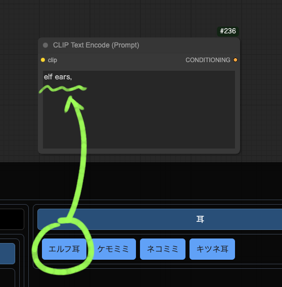

# D2-PromptSelector-comfyUI

<figure>
    <a href="README_en.md">English</a> | <a href="README.md">日本語</a> | <a href="README_zh.md">繁体中文</a>
</figure>


A utility that allows you to input registered prompts with a single button click.

This is a remake of the [sd-d2-prompt-selector](https://github.com/da2el-ai/sd-d2-prompt-selector) extension for StableDiffusion webui A1111, adapted for ComfyUI.


<figure>

</figure>


## How to Use

Open it by clicking the "PS" button on the left edge of the screen.

<figure>
    
</figure>

Clicking a tag button will input it into **the last active text area**.

**【TIPS】** If you right-click, the PromptSelector dialog will close after inputting the tag.

<figure>
    
</figure>

Clicking a category button will input it using DynamicPrompt syntax.

<figure>
    
</figure>

Click the 🔍 button to search.

<figure>
    
</figure>


## Adding Tags

Edit the YAML files in the `tags` folder at the installation location.
Example: `ComfyUI/custom_nodes/d2-promptselector-comfyui/tags`

YAML files are just text files, so they can be edited with a notepad app.
Personally, I recommend Visual Studio Code.

When adding a YAML file, you need to edit `__config__.yml`.
If you add `pose.yml`, it would look like this. The order can be changed as desired.

```yaml:__config__.yml
sort:
  - 人
  - 人_顔
  - 人_髪
  - pose
```

Click the 🔄 button to reflect the edited tags.

<figure>
    
</figure>


## Settings

The position of the "PS" button can be specified in Settings.

<figure>
    
</figure>

- ShowButton Vertical Margin(px)
  - Y-coordinate from the edge of the screen
- ShowButton Horizontal Margin(px)
  - X-coordinate from the edge of the screen
- ShowButton Location
  - Reference position from the edge of the screen
