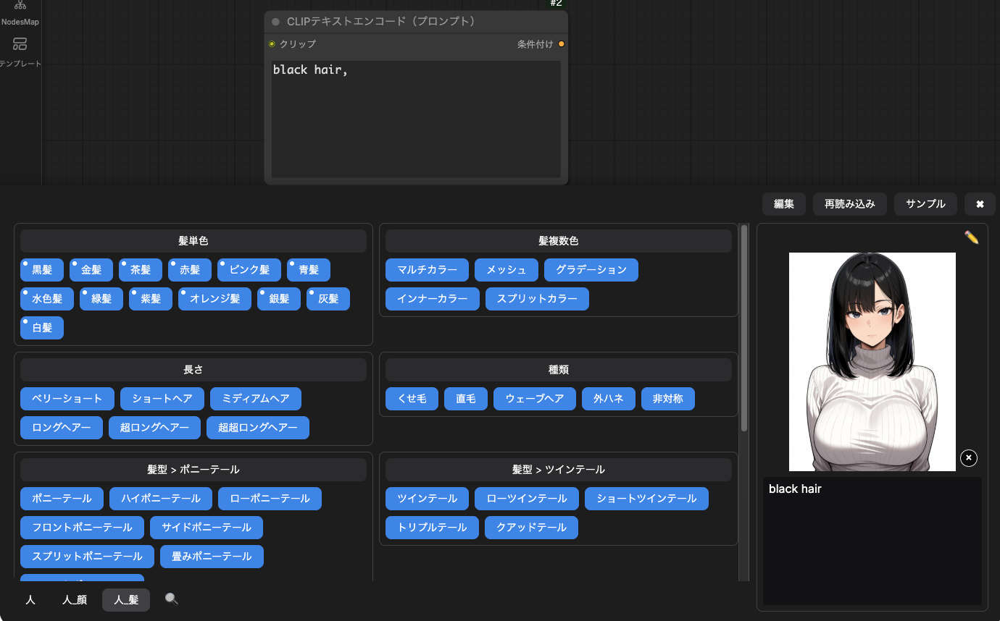
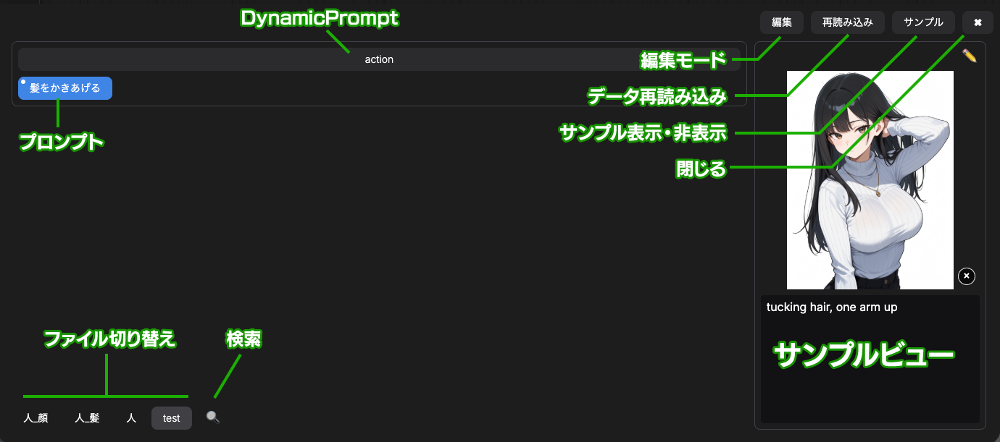
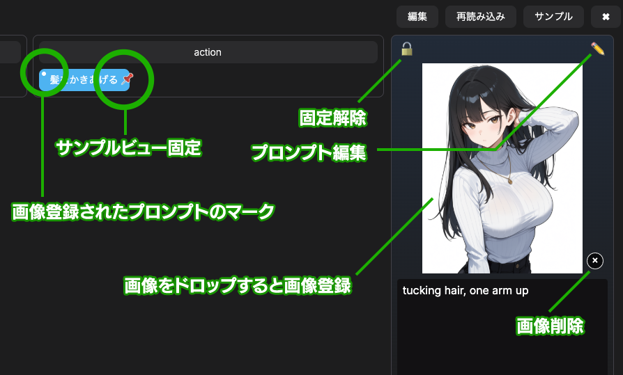
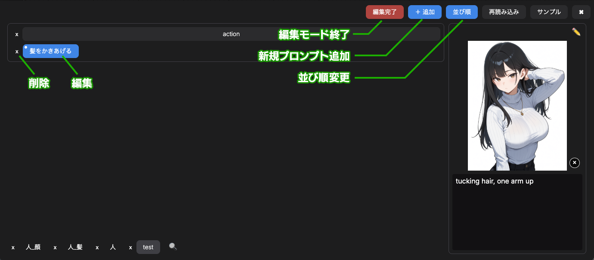
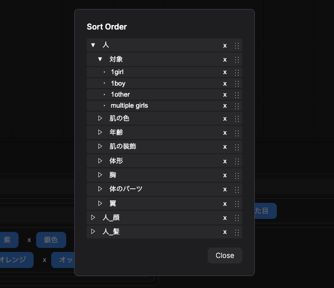
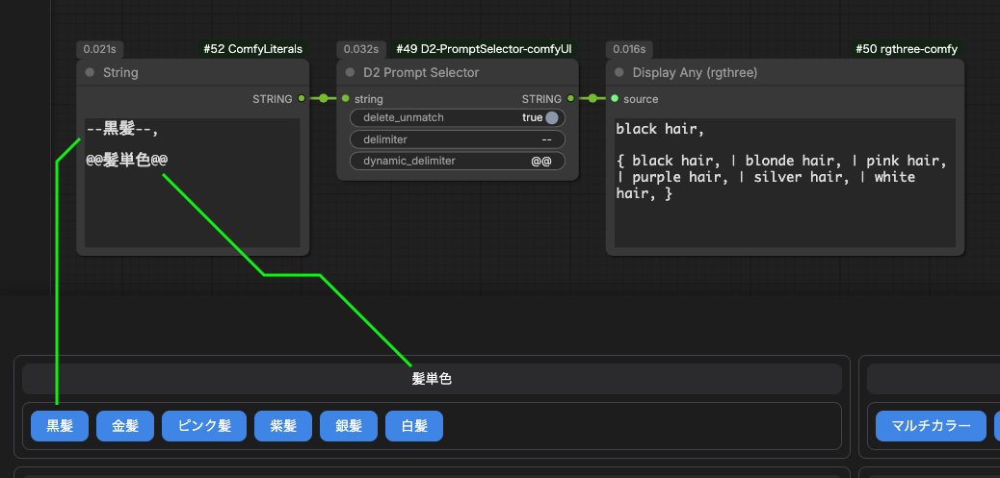
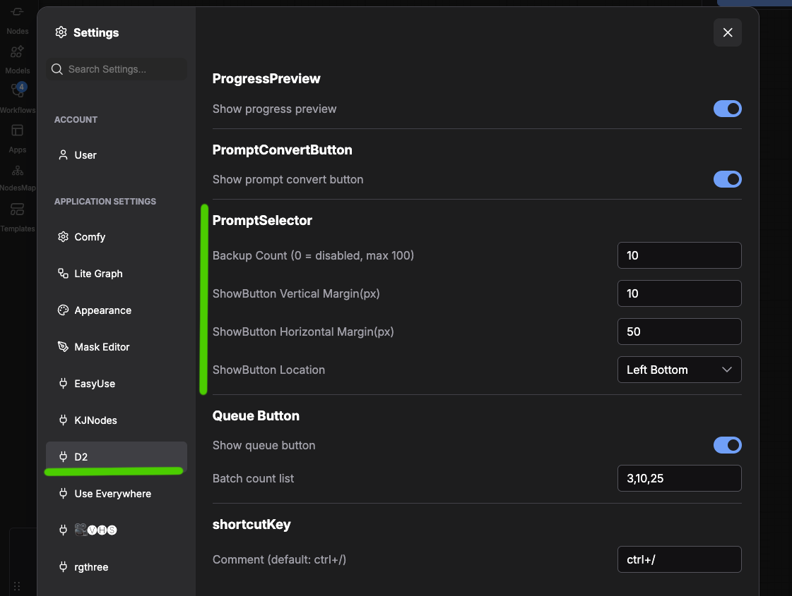

# D2-PromptSelector-comfyUI

[English](README_en.md) | [日本語](README.md) | [繁體中文](README_zh.md)

只需點擊按鈕即可輸入已登錄提示詞的工具。




---

## 主要功能

- **輕鬆輸入提示詞：** 點擊按鈕即可輸入已登錄的提示詞
- **範例圖片顯示：** 一邊看圖片一邊尋找提示詞
- **編輯功能：** 新增、編輯、刪除、排序提示詞與分類
- **搜尋功能：** 即時搜尋名稱與提示詞
- **多語言對應：** 支援日文 / 英文 / 簡體中文 / 繁體中文（使用者也可自行新增語言）
- **自動備份：** 預設保留最多 10 個版本


---


## 開啟 Prompt Selector

點擊畫面左下角的「PS」按鈕開啟。


## 面板操作




### 提示詞

點擊提示詞按鈕後，提示詞會輸入到**最後一個處於作用中的文字區域**。

>【提示】 以右鍵點擊（或 Ctrl+點擊）輸入後，會關閉 Prompt Selector 面板。

### DynamicPrompt

點擊分類名稱按鈕後，該分類所包含的提示詞會以 DynamicPrompt 語法輸入。

範例：<br>
分類：`髮色`<br>
已登錄提示詞：`black hair` `blonde hair` `silver hair`<br>
輸入結果：`{ black hair, | blonde hair, | silver hair, }`

※ 若要使用 DynamicPrompt 語法，需要安裝 [comfyui-dynamicprompts](https://github.com/adieyal/comfyui-dynamicprompts) 等自訂節點。

### 切換檔案（分頁）

每個提示詞檔案即為一個分頁。<br>
在後述的編輯模式中新增檔案即可增加分頁。

### 搜尋

選擇 🔍 分頁即可搜尋。名稱與提示詞皆以部分相符的方式搜尋。

### 編輯

進入編輯模式（後述）。

### 重新載入

重新載入提示詞檔案，並將提示詞列表更新為最新狀態。

### 範例

切換範例檢視的顯示／隱藏。
隱藏時，提示詞按鈕上的 📌 也會一併隱藏。


---

## 範例檢視



在面板右側的範例檢視中，會顯示提示詞的 **範例圖片** 與提示詞文字。可以一邊看圖片一邊尋找目標提示詞。

### 顯示（滑鼠停留）

將滑鼠停留在提示詞按鈕上，該項目的圖片與提示詞便會顯示在範例檢視中。即使移開游標，仍會保留上一次顯示的內容。

### 固定範例檢視

將滑鼠停留在提示詞按鈕上時，右端會出現 📌。點擊 📌 即可將該項目固定到範例檢視。按下其他提示詞的 📌，固定對象便會切換過去。

若要解除固定，請點擊範例檢視左上方的解除固定按鈕 🔓。

### 已登錄圖片的提示詞

已登錄圖片的提示詞按鈕，會在左上方顯示一個小白點。

### 登錄範例圖片

可透過下列任一方式登錄圖片。支援的格式為 **png / jpeg / webp**（不會縮放，也沒有大小上限）。

- **直接拖放：** 將圖片檔案拖放到範例檢視的圖片區域，即可登錄到目前顯示的提示詞。若已有圖片則會被替換。
- **編輯對話框：** 以範例檢視右上方的 ✏️ 按鈕（即使不在編輯模式也可使用）開啟該提示詞的編輯對話框，再將圖片拖放到對話框下方的圖片區域。新增提示詞時，也可從新增對話框的圖片區域登錄。

### 刪除範例圖片

以縮圖右下角的 `×` 按鈕刪除圖片。刪除提示詞、分類或檔案時，所連結的範例圖片也會一併刪除。

---

## 編輯模式


以控制列的「編輯」按鈕進入編輯模式，以「完成」返回。




### 新增提示詞

在編輯模式中，點擊「＋ 新增」按鈕會開啟新增對話框，輸入以下項目：

- 分頁（檔案）：從現有項目選擇或新建
- 分類：從現有項目選擇或新建
- 名稱（顯示名稱）
- 提示詞（支援多行）
- 圖片（選用）：拖放到對話框下方的圖片區域即可登錄（png / jpeg / webp）

### 編輯／刪除提示詞

在編輯模式中，點擊提示詞按鈕會開啟編輯對話框。每個提示詞左側顯示的 `×` 可將其刪除。<br>
也可從編輯對話框下方的圖片區域登錄、替換或刪除範例圖片。

### 編輯／刪除分類

在編輯模式中，點擊分類名稱按鈕會開啟編輯對話框，可重新命名或移動到其他檔案。分類名稱左側的 `×` 可將整個分類刪除（其中包含的提示詞也會一併刪除）。

### 刪除檔案

在編輯模式中，可透過各分頁左側的 `×` 按鈕刪除檔案。刪除時需在確認對話框中正確輸入檔案名稱（以防誤操作）。

變更檔案名稱可在後述的排序對話框中進行。

### 排序對話框

在編輯模式中，以「排序」按鈕開啟樹狀檢視的對話框。




- 以樹狀結構顯示 檔案 → 分類 → 提示詞 的 3 個層級
- 點擊標籤可顯示編輯對話框
- 拖曳 `⋮⋮` 進行排序
- 點擊 `x` 進行刪除


### 給舊版本使用者：編輯功能的限制

首次嘗試進入編輯模式時，若提示詞檔案為舊格式（多層級・陣列混雜），會顯示轉換確認對話框。轉換前的狀態會備份到 `tags_migration/` 資料夾。

**轉換前：**
```
hair:
  color:        # 分類為多層級
    black: black hair,
    blonde: blonde hair,
hair style:
  - ponytail    # 無名稱的陣列
  - twintails
```
**轉換後：**
```
hair > color:   # 攤平為單層
  black: black hair,
  blonde: blonde hair,
hair style:
  ponytail: ponytail    # 變為具名清單
  twintails: twintails
```

---

## 備份

在進行寫入類操作（新增・編輯・刪除・變更檔案名稱）的前一刻，會自動將整個 `tags/` 的快照儲存到 `tags_bak_YYYYMMDD_HHMMSS/` 資料夾。

- 保留數量可透過 **Backup Count** 設定變更（預設 10、最大 100、設為 0 則停用）
- 超過數量的舊備份會自動刪除
- 排序變更（拖放）不會建立備份
- 轉換（舊格式 → 新格式）會儲存到專用的 `tags_migration/` 資料夾（不在輪替範圍內）

---

## D2 Prompt Selector 文字轉換節點



這是為覺得從面板呼叫提示詞很麻煩的人所準備的節點。

它會偵測輸入文字中的特殊標記，將其轉換成已登錄的提示詞並輸出。**不必在面板上點擊按鈕，即可在工作流程中組合提示詞。**

- 將 `--{登錄名}--` 轉換為已登錄的提示詞
- 以 `@@{分類名}@@` 將分類內的提示詞轉換為 DynamicPrompt 語法
- 採完全相符比對。包圍符號 `--` `@@` 可透過輸入變更（用於避免與其他擴充功能衝突）

### Input

| 輸入 | 型別 | 說明 |
| --- | --- | --- |
| `string` | STRING | 提示詞輸入<br>範例：`1girl, --beautiful--, best quality` |
| `delete_unmatch` | BOOLEAN | 無法轉換的標記的處理方式<br>`True`：刪除標記<br>`False`：保留標記原樣 |
| `delimiter` | STRING | 一般轉換標記的包圍符號<br>初始值：`--` |
| `dynamic_delimiter` | STRING | DynamicPrompt 轉換標記的包圍符號<br>初始值：`@@` |

### Output

| 輸出 | 型別 | 說明 |
| --- | --- | --- |
| `string` | STRING | 轉換後的文字 |

### 提示詞指定格式

輸入 `--{登錄名}--` 即可輸出已登錄的提示詞。
若有多個以相同名稱登錄的提示詞，也可使用完整路徑 `{分頁名}/{分類名}/{登錄名}` 來指定。

以下列檔案已登錄的情況為例：

```yaml
# bg.yml（分頁名：bg）
quality:
    beautiful: Beautiful lighting, highly detailed environment
place:
    stream: nature, stream, rock, wood
    classroom: classroom, window, curtain, desk, chair, chalkboard
```

```
輸入：1girl, solo, --beautiful--, best quality
輸出：1girl, solo, Beautiful lighting, highly detailed environment, best quality
```

若要以完整路徑指定，可寫成 `--bg/quality/beautiful--`。

將分類名稱寫成 `@@{分類名}@@`，即可將該分類內的提示詞以 DynamicPrompt 語法輸出。
同樣地，若有多個相同名稱的分類，也可使用完整路徑 `{分頁名}/{分類名}` 來指定。

```
輸入：@@place@@
輸出：{ nature, stream, rock, wood, | classroom, window, curtain, desk, chair, chalkboard, }
```

若要以完整路徑指定，可寫成 `@@bg/place@@`。

### 標記方式一覽

| 格式 | 轉換內容 |
| --- | --- |
| `--登錄名--` | 依序搜尋所有分頁，轉換為第一個相符登錄名的提示詞<br>範例：`--stream--` |
| `--分頁 或 分類/登錄名--` | 在指定分頁內搜尋。找不到時則視為分類名稱並搜尋所有分頁<br>範例：`--bg/stream--` `--place/stream--` |
| `--分頁/分類/登錄名--` | 以完整路徑指定分頁・分類・登錄名<br>範例：`--bg/place/stream--` |
| `@@分類@@` | 依序搜尋所有分頁，將第一個相符的分類以 DynamicPrompt 語法輸出<br>範例：`@@place@@` |
| `@@分頁/分類@@` | 以完整路徑指定分頁・分類<br>範例：`@@bg/place@@` |

- 搜尋會依分頁順序（`__config__.yml` 的 `sort`）進行，並以第一個相符項目轉換
- 採完全相符（`beautiful` 不會與 `beautiful2` 相符）
- 含有空格的標記（範例 `-- bg / quality / beautiful --`）不會被轉換


---

## 直接編輯提示詞檔案

你也可以直接編輯提示詞檔案（YAML 格式）。<br>
檔案儲存於 `{ComfyUI 安裝資料夾}/custom_nodes/D2-PromptSelector-comfyUI/tags/`。

```yaml
対象:
    1girl: 1girl
    1boy: 1boy

年齢:
    ティーン: teen
    ローティーン: early teen
```

- 每個分類為 `名稱: 提示詞` 的字典格式
- 名稱可使用非英數字字元
- 不支援兩層以上的巢狀與陣列格式（舊格式檔案會在首次編輯時顯示轉換對話框）

已登錄圖片的提示詞，其值會變成 `名稱: { prompt: …, image: 檔名 }` 的格式。圖片檔案儲存於 `prompt_images/`。

```yaml
髮色:
    黑髮:
        prompt: black hair
        image: black_hair.webp   # 帶圖片的提示詞
    金髮: blonde hair             # 無圖片時維持原本的字串
```

### 新增檔案

在 `tags/` 中新增 YAML 檔案後，將其追加到 `__config__.yml` 的 `sort`。<br>
順序可自由變更。

```yaml
# __config__.yml
sort:
    - 人
    - 人_顔
    - 人_髪
    - ポーズ
```

編輯後透過 🔄 按鈕或重新載入 ComfyUI 即可套用。

---

## 設定

可在 ComfyUI 的 Settings 進行以下設定。



| 設定項目                         | 內容                                     |
| -------------------------------- | ---------------------------------------- |
| ShowButton Location              | 「PS」按鈕的畫面邊緣基準位置             |
| ShowButton Horizontal Margin(px) | 距畫面邊緣的 X 方向邊距                  |
| ShowButton Vertical Margin(px)   | 距畫面邊緣的 Y 方向邊距                  |
| Backup Count                     | 備份保留數量（0〜100、0 則停用）         |

---

## 多語言對應

關於支援的語言以及使用者新增語言的方式，請參閱 [docs/i18n_zh.md](docs/i18n_zh.md)。

---

## 版本紀錄

**v4.0.0**
- 新增範例圖片顯示功能

**v3.0.0**
- 新增文字轉換節點

**v2.0.0**
- 新增提示詞編輯功能

---

## 授權

MIT
