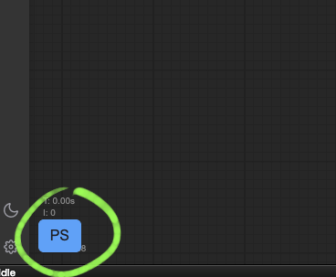

# D2-PromptSelector-comfyUI

<figure>
    <a href="README_en.md">English</a> | <a href="README.md">日本語</a> | <a href="README_zh.md">繁体中文</a>
</figure>


這是一個可以讓您一鍵輸入已註冊提示詞的實用工具。

這是為StableDiffusion webui A1111開發的擴展功能 [sd-d2-prompt-selector](https://github.com/da2el-ai/sd-d2-prompt-selector) 的ComfyUI版本。


<figure>

</figure>


## 使用方法

點擊螢幕左側的「PS」按鈕開啟。

<figure>
    
</figure>

點擊標籤按鈕將在**最後活動的文字區域**中輸入。

**【TIPS】** 如果您右鍵點擊，PromptSelector對話框將在輸入標籤後關閉。

<figure>
    
</figure>

點擊類別按鈕將使用DynamicPrompt語法輸入。

<figure>
    
</figure>

點擊🔍按鈕可以進行搜索。

<figure>
    
</figure>


## 添加標籤

編輯安裝位置的`tags`資料夾中的YAML檔案。
例如：`ComfyUI/custom_nodes/d2-promptselector-comfyui/tags`

YAML檔案只是純文字檔案，所以可以使用記事本應用程式進行編輯。
個人推薦使用Visual Studio Code。

添加YAML檔案時，需要編輯`__config__.yml`。
如果添加了`姿勢.yml`，它會如下所示。順序可以根據需要更改。

```yaml:__config__.yml
sort:
  - 人
  - 人_顔
  - 人_髪
  - ポーズ
```

點擊🔄按鈕以反映編輯後的標籤。

<figure>
    
</figure>


## 設定

「PS」按鈕的位置可以在設定中指定。

<figure>
    
</figure>

- ShowButton Vertical Margin(px)
  - 距離螢幕邊緣的Y座標
- ShowButton Horizontal Margin(px)
  - 距離螢幕邊緣的X座標
- ShowButton Location
  - 螢幕邊緣的參考位置
